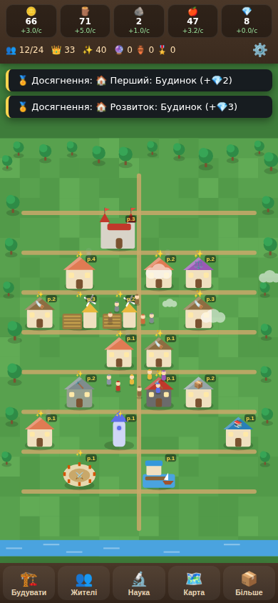

# 👑 Tiny Kingdom — Маленьке Королівство

Мобільна idle-гра для Android: успадкуй занедбане королівство та перетвори його на
найбагатше й найкрасивіше у світі.



## 🎮 Що всередині

| Система | Деталі |
|---|---|
| 🏗️ Будівництво | 15 будівель, кожна з 10 рівнями (Будинок → Палац) |
| 👥 Жителі | 8 професій, автоматична робота, навчання в Академії, живі анімовані персонажі |
| 📦 Ресурси | Золото, деревина, камінь, їжа, кристали + рідкісні (🔮 магічні кристали, 🏺 реліквії, 🎖️ медалі) |
| 🔬 Дослідження | 12 гілок технологій (швидше будівництво, автоматизація, торгівля…) |
| 🗺️ Карта світу | 7 зон: Ліс, Озеро, Гори, Пустеля, Засніжені землі, Вулкани, Магічний ліс |
| 🧭 Експедиції | 3 тривалості, здобич, нові жителі, предмети колекцій |
| 🎪 Події | Караван купців, свято врожаю, напад гоблінів, скарби, портали, турніри |
| 🏆 Колекції | 6 колекцій × 8 предметів, кожна дає бонуси, повний набір — суперприз |
| 🏅 Досягнення | 155 досягнень із нагородами |
| 📜 Щоденні квести | 5 нових квестів щодня |
| 🌙 Офлайн-прогрес | до 12 годин накопичення, подвоєння за рекламу |
| 🛍️ Монетизація | reward-реклама (заглушка з готовим мостом під AdMob), косметика замку, другий будівельник — без нав'язливої реклами |
| 🌦️ Атмосфера | День/ніч із плавним освітленням, погода (сонце/дощ/сніг), хмари, птахи, сезонні події (Новий рік, Гелловін, Великдень) |
| 💾 Збереження | Автозбереження кожні 10 сек + при згортанні (localStorage) |
| 🔊 Звук | Процедурні звуки та затишна фонова музика (WebAudio, без файлів) |

Мова інтерфейсу — українська. Орієнтація — вертикальна.

## 🚀 Швидкий запуск (веб-версія)

Гра — це чистий HTML5/Canvas без залежностей і збірки:

```bash
# будь-який статичний сервер, або просто відкрий index.html у браузері
npx serve .
```

## 🤖 Збірка Android APK

Готовий проєкт-обгортка лежить в `android/` (WebView + міст для реклами).
Веб-файли гри автоматично копіюються в assets при кожній збірці.

```bash
cd android
./gradlew assembleDebug        # APK: app/build/outputs/apk/debug/
./gradlew bundleRelease        # AAB для Google Play (потрібен signingConfig)
```

Або відкрий папку `android/` в Android Studio та натисни Run. Вимоги: JDK 17,
Android SDK 34 (Android Studio підтягне сам). `minSdk 26` (Android 8+).

### Чек-лист перед публікацією в Google Play

1. **Підпис**: створи keystore і додай `signingConfig` у `app/build.gradle`.
2. **Реклама**: підключи AdMob — у `MainActivity.AndroidBridge.showRewardedAd()`
   позначено TODO; після нагороди виклич `grantAdReward(kind)`. Додай дозвіл INTERNET.
3. **Покупки**: гачки крамниці готові (`UI.shopHtml`), підключи Play Billing для
   преміум-перепустки та наборів.
4. Іконка (адаптивна, векторна) і назва вже налаштовані — за бажанням заміни.

## 🧩 Як додавати контент (для майбутніх оновлень)

Увесь контент описаний даними в `js/data.js` — код підхоплює його автоматично:

- **Нова будівля** → запис у `BUILDINGS` (+ гілка в `Renderer.drawBuilding` для унікального вигляду, інакше малюється базовий будиночок з деталлю).
- **Нова зона** → запис у `ZONES` (бонус, вартість, рівень замку).
- **Нове дослідження** → `RESEARCH`; **подія** → `EVENTS` + гілки в `Game.eventData/resolveEvent` та `UI.openEvent`.
- **Колекція/предмети** → `COLLECTIONS`; **досягнення** → шаблони в `buildAchievements()`.

## 📁 Структура

```
index.html          — точка входу
css/style.css       — інтерфейс (мобільний, вертикальний)
js/data.js          — ВЕСЬ контент гри (будівлі, зони, події, колекції…)
js/game.js          — економіка, збереження, офлайн, експедиції, квести
js/render.js        — Canvas-рендер: місто, жителі, день/ніч, погода
js/ui.js            — панелі, модалки, крамниця
js/audio.js         — процедурний звук і музика
js/main.js          — головний цикл
android/            — Android-проєкт (WebView-обгортка, готова до збірки)
```
